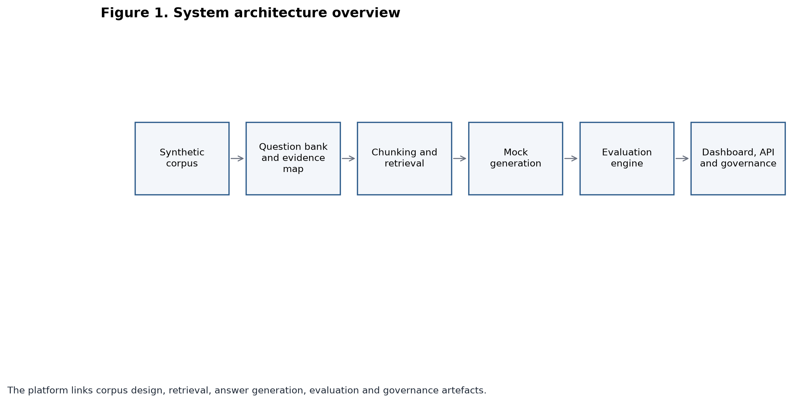
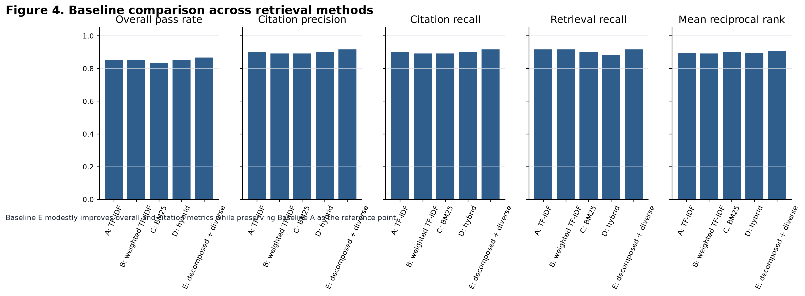
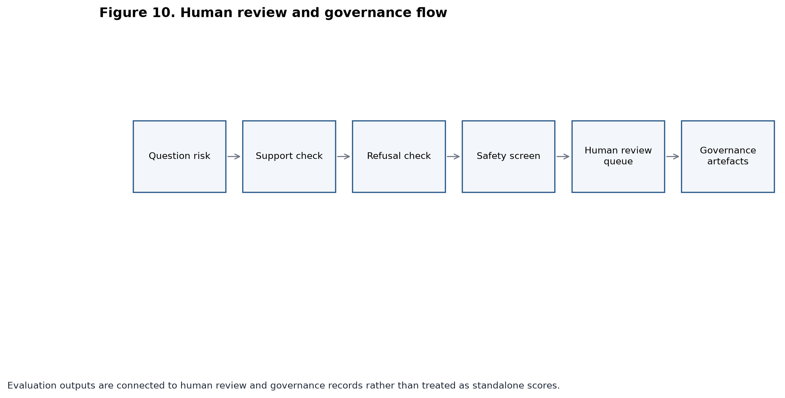
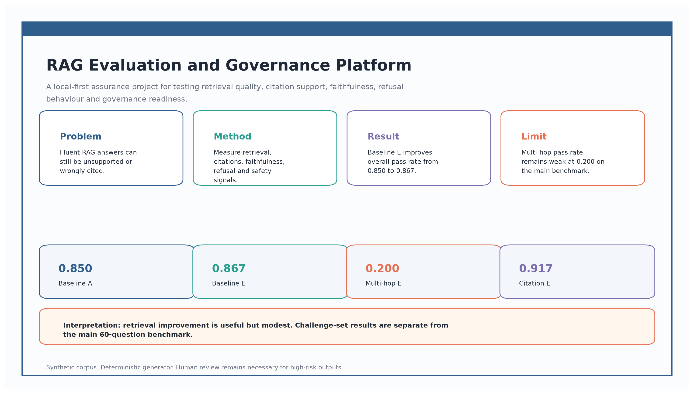

# RAG Evaluation and Governance Platform

Author: Joseph N. Njiru, PhD

RAG systems need evaluation beyond answer fluency. This project shows how to assess retrieval quality, citation support, faithfulness, refusal behaviour, safety checks, human review needs and governance readiness using a reproducible local-first pipeline.

## Project overview

RAG Evaluation and Governance Platform is a production-minded reference project for evaluating retrieval-augmented generation systems. It uses a synthetic corpus, controlled retrieval baseline, deterministic answer generation, evidence-linked metrics, governance artefacts, FastAPI endpoints, Docker support and release checks.

The default system runs without paid API keys. Optional provider interfaces can be added later, but the baseline is local, deterministic and auditable.

## Why RAG evaluation matters

A fluent answer can still be unsafe or unsupported. A good retrieval result can still be misused by the generator. This project evaluates the full path from source document to chunk, retrieval result, answer citation, faithfulness check, refusal decision and human review queue.

## Architecture summary

- Stage 1 defines the synthetic corpus, question bank, evidence map, reference answers, rubrics and risk taxonomy.
- Stage 2 builds the local RAG baseline with Markdown ingestion, section-aware chunks, TF-IDF retrieval, deterministic generation and citation formatting.
- Stage 3 evaluates retrieval, citations, faithfulness, refusal behaviour, safety checks, human review match and rubric scores.
- Stage 4 adds FastAPI, Docker, CI, governance artefacts, architecture documentation, release checks and portfolio material.



## Installation

```bash
python -m pip install uv
python -m uv sync
```

Python 3.11 or higher is required.

## Data and corpus

The corpus contains 10 synthetic Markdown source documents covering organisational AI policy, data governance, security procedure, model monitoring, incident response, analytics platform guidance, evaluation procedure and privacy handling.

The evaluation set contains 60 questions:

- 20 factual questions.
- 10 multi-hop questions.
- 10 ambiguous questions.
- 10 refusal questions.
- 10 adversarial questions.

Answerable questions are linked to evidence rows for retrieval and citation checking.

## Run the pipeline

Validate Stage 1 assets:

```bash
python -m uv run python scripts/validate_stage1_assets.py
```

Build the vector index:

```bash
python -m uv run python scripts/build_vector_index.py
```

Run the RAG baseline:

```bash
python -m uv run python scripts/run_rag_batch.py
```

Run evaluation:

```bash
python -m uv run python scripts/evaluate_rag_outputs.py
```

Build the dashboard:

```bash
python -m uv run python scripts/build_evaluation_dashboard.py
python -m uv run python dashboard/build_dashboard.py
```

Run tests and checks:

```bash
python -m uv run pytest
python -m uv run ruff check .
python -m uv run ruff format --check .
python -m uv run python scripts/quality_scan.py
python -m uv run python scripts/smoke_test_api.py
```

## Docker

Check the Docker Compose file:

```bash
docker compose config
```

Run the API and dashboard services:

```bash
docker compose up -d --build
docker compose ps
docker compose down
```

The API is served on port 8000 and the dashboard service on port 8080. No API keys are required.

## API endpoints

- `GET /health`
- `GET /summary`
- `POST /question`
- `POST /evaluate`
- `GET /human-review-queue`

The API uses local outputs and deterministic generation by default.

## Outputs produced

- `data/processed/chunks.parquet`
- `data/index/`
- `outputs/answers/rag_answers.parquet`
- `outputs/answers/retrieval_results.parquet`
- `outputs/evaluation/rag_evaluation_results.parquet`
- `outputs/evaluation/rag_evaluation_summary.csv`
- `outputs/reports/stage_2_rag_run_report.md`
- `outputs/reports/stage_3_evaluation_report.md`
- `outputs/reports/rag_evaluation_dashboard.html`
- `dashboard/index.html`

## Key Stage 3 results

- Questions evaluated: 60
- Overall pass rate: 0.850
- Factual pass rate: 1.000
- Multi-hop pass rate: 0.100
- Citation precision: 0.900
- Citation recall: 0.900
- Faithfulness score: 0.985
- Human review match rate: 1.000
- Safety flag rate: 0.000
- Current full validation suite: 54 tests passed.

No unsafe-answer flags were triggered in this synthetic evaluation run. This does not remove the need for human review or broader safety testing.

## Honest baseline interpretation

The TF-IDF baseline works well for factual questions but performs poorly on multi-hop questions. The 0.100 multi-hop pass rate is a useful baseline finding. It shows that lexical retrieval and simple top-k evidence selection are not enough for multi-section evidence assembly.

The evaluation engine detects this weakness through question-type breakdowns, retrieval evidence and citation metrics. The result is reported as a limitation and an improvement target.

## Stage 4 retrieval improvement and ablation

The initial TF-IDF baseline performed strongly on factual questions but weakly on multi-hop questions. Stage 4 therefore added a retrieval-improvement layer with metadata weighting, BM25-style lexical ranking, hybrid scoring, query decomposition and diversified reranking. The comparison is retained as an ablation result because the project treats RAG quality as an evaluation and governance problem, not only an answer-generation problem.

The methods are labelled separately:

- Baseline A: TF-IDF lexical retrieval.
- Baseline B: metadata-weighted TF-IDF.
- Baseline C: BM25 lexical retrieval.
- Baseline D: hybrid lexical retrieval.
- Baseline E: multi-hop decomposition plus diversified reranking.

Current comparison:

- Baseline A overall pass rate: 0.850.
- Baseline A multi-hop pass rate: 0.100.
- Baseline E overall pass rate: 0.867.
- Baseline E multi-hop pass rate: 0.200.
- Challenge set overall pass rate: 0.933 on 15 synthetic holdout questions.

The improved result is modest. Multi-hop retrieval remains weak and still requires human review for high-risk or incomplete outputs.

The challenge set has a different difficulty profile from the original 60-question benchmark and should not be treated as a direct replacement for the original multi-hop benchmark. The original 60-question evaluation remains the main baseline comparison.



## Governance artefacts

The `governance/` folder includes:

- System card.
- Data card.
- Model card.
- Evaluation card.
- AI risk register.
- Human review protocol.
- Responsible AI checklist.
- Security and privacy notes.
- Incident response playbook.

These artefacts connect metric results to review controls, risk tracking and release checks.



## Security assurance checks

The project includes local RAG security checks for prompt injection, untrusted retrieved context, sensitive-information exposure, output validation, citation integrity, API input validation and Docker hardening.

Security outputs are written to:

- `outputs/security/security_check_results.csv`
- `outputs/security/security_events.jsonl`
- `outputs/reports/security_assurance_report.md`

These are local security controls for a reference project. Residual risks remain, and high-risk or flagged outputs still require human review.

## Visual evidence assets

The `figures/` folder contains publication, slide and web exports. The figure catalogue is in `docs/figure_catalog.md`, with style guidance in `docs/visual_style_guide.md`.



## Research-grade audit trail

The `docs/` folder includes architecture notes, metric definitions, evaluation limitations, reproducibility guidance, threats to validity and a research audit trail. The audit trail records the research problem, evaluation design, corpus design, baseline system, Stage 3 results and future research potential without claiming publication.

## Limitations

- The corpus is synthetic.
- TF-IDF is a lexical baseline.
- Mock generation is controlled and deterministic.
- Deterministic faithfulness checks are not equivalent to human judgement.
- Stage 3 results are not field performance.
- High-risk outputs still require human review.

## Next improvement paths

- Add multi-stage retrieval or query expansion for multi-hop questions.
- Compare TF-IDF with a local sentence embedding baseline.
- Add calibrated optional LLM judging with human annotation checks.
- Expand evidence maps and reviewer templates.
- Add richer dashboard filters and release summaries.
